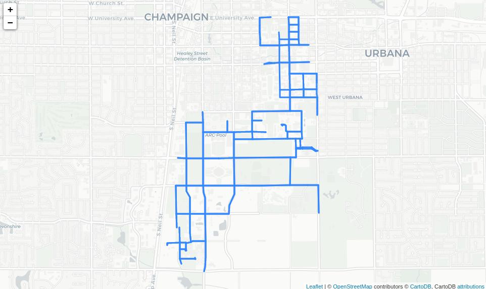
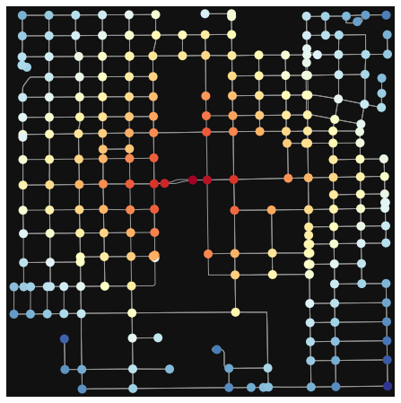

# Introduction to OpenStreetMap (OSM) Network Data

**Author:** Alexander Michels

This Notebook is meant to be a brief guide on working with [Open Street Map (OSM)](https://www.openstreetmap.org/) network data, primarily using the [OSMnx](https://osmnx.readthedocs.io/) Python package. It walks through obtaining network data from OSMnx, exploring the data, and a simple use case of calculating free-flow travel time on the network as illustrated below:

